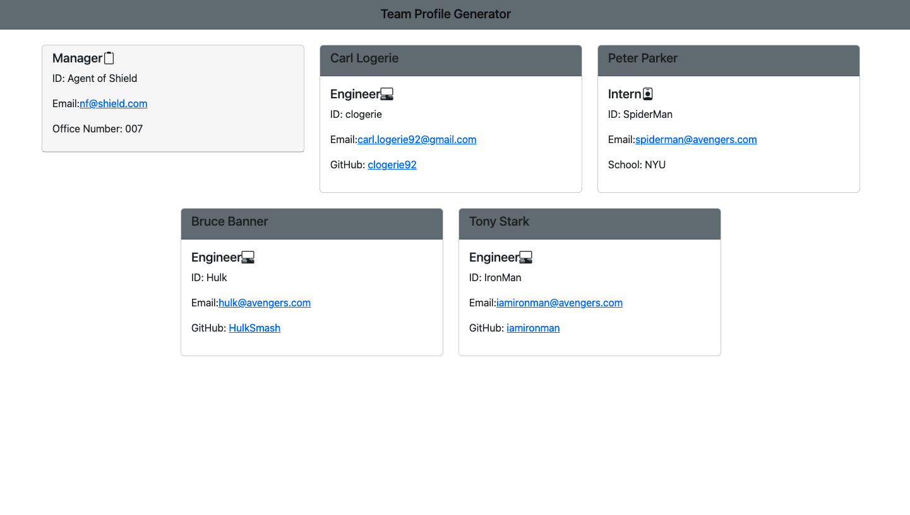

# Team-Profile-Generator

## Description

This is a Node.js command-line application that takes in information about employees on a software engineering team, then generates an HTML webpage that displays summaries for each person.

## Table of Contents
* [Installation](#installation)
* [Usage](#usage)
* [License](#license)
* [Contributing](#contributing)
* [Tests](#tests)
* [Questions](#questions)

## Mock-Up

The following image shows a mock-up of the generated HTML’s appearance and functionality:

## Installation 
The user should clone the repository from GitHub and install Node. This application also requires a file system, inquirer module and uses Jest for testing. 

## Usage 
Use inquirer from your command line to answer questions about your project.
View walk through video here - [Screencastify]() 

## License 
This project is license under MIT

## Contributing 
Contributors should reference the installation section. 

## Tests
Run `npm test` to run Jest for tests. 

## Questions
Please contact me at carl.logerie92@gmail.com with any questions.
